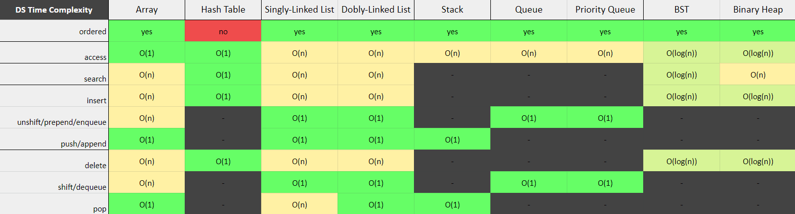

# data-structures 📚

Data structures and its CRUD methods implemented in JavaScript: Array, Hash Table, Linked List (singly and doubly), Stacks, Queues, Priority Queues, Binary Trees, Binary Heaps and Graphs

______________________

